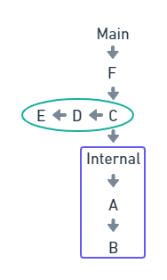

# Package

Ao criar um pacote em Go, normalmente, o objetivo final é tornar o pacote acessível para uso por outros desenvolvedores. Ao importar o pacote, seu código poderá servir como o bloco de construção para outras ferramentas mais complexas. No entanto, apenas certos pacotes estão disponíveis para importação. Isso é determinado pela visibilidade do pacote.

Ao contrário do que ocorre em outras linguagens de programação, que usam modificadores de acesso, como `public`, `private` ou `protected` para especificar o escopo, a linguagem Go determina se um item é exportado (em inglês, _exported_) e não exportado (em inglês, _unexported_) pela forma como é declarado. Exportar um item neste caso torna ele visível fora do pacote atual. Caso não seja exportado, ele fica apenas visível e utilizável dentro do pacote em que foi definido.

Esta visibilidade externa é controlada colocando-se a __primeira letra__ do item declarado em __maiúscula__. Todas as declarações, tais como Types, Variables, Constants, Functions etc., que começam com uma letra maiúscula, ficam visíveis fora do pacote atual.

```go
package greet

import "fmt"

var Greeting string

func Hello(name string) string {
    return fmt.Sprintf(Greeting, name)
}
```

Esse código declara que ele está no pacote `greet`. Depois, ele declara dois símbolos, uma variável chamada `Greeting` e uma função chamada `Hello`. Como ambas começam com uma letra maiúscula, as duas são _exported_ e disponibilizadas para qualquer programa exterior.

## Convenção

Os nomes de pacotes em Go devem ser curtos e claros e no singular. Eles devem ser em caixa baixa, sem _underscore_ ou _mixedCaps_ como no exemplo abaixo:

```txt
time (provides functionality for measuring and displaying time)
list (implements a doubly linked list)
http (provides HTTP client and server implementations)
```

O nome do pacote deve ser igual a sua pasta, exemplo:

```txt
time -> src/time/
list -> src/container/list/
http -> src/net/http/
```

## Escopo

O escopo de um pacote é o diretório no qual o arquivo se encontra. Arquivos de um mesmo diretório que declaram o mesmo pacote serão considerados arquivos desse pacote. Mesmo que um arquivo em um subdiretório declarar o mesmo nome de pacote, este será considerado outro pacote.

## Main Package

Um programa Go começa inicializando o pacote `main` e, em seguida, executa a função `main` desse pacote. O pacote `main` é onde seu programa começa a fazer o que foi criado para fazer. Abaixo um exemplo de um pacote `main`:

```go
package main

import "fmt"

func init() {
    fmt.Println("launch initialization")
}

func main() {
    fmt.Println("launch the program!")
}

// Saída:
// launch initialization
// launch the program!
```

> __Note__
> No exemplo acima também temos uma função `init`. Esta função pode conter todas as tarefas de inicialização necessárias para que o programa seja executado corretamente. Se esta função estiver presente no mesmo arquivo, ela será executada primeiro e em seguida a função `main`.

## Internal packages

São os pacotes internos, contidos em um diretório chamado `internal`. Diretórios com este nome são reconhecidos pela ferramenta que impedirá que um pacote seja importado por outro, a menos que ambos compartilhem um ancestral comum.

Somente os pacotes do diretório e subdiretórios do pai (raiz) do diretório `internal` podem acessar os pacotes contidos em `internal`.

No exemplo abaixo, somente os pacotes do diretórios `C`, `D` e `E` e os próprios pacotes internos, podem acessar os pacotes em `A` e `B`. Uma vez que `C` é a raiz de `internal`, todos pacotes em `C` e descendentes podem acessar os pacotes internos.



## Referência

- <https://www.digitalocean.com/community/tutorials/understanding-package-visibility-in-go-pt>
- <https://www.practical-go-lessons.com/chap-11-packages-and-imports#the-internal-directory>

